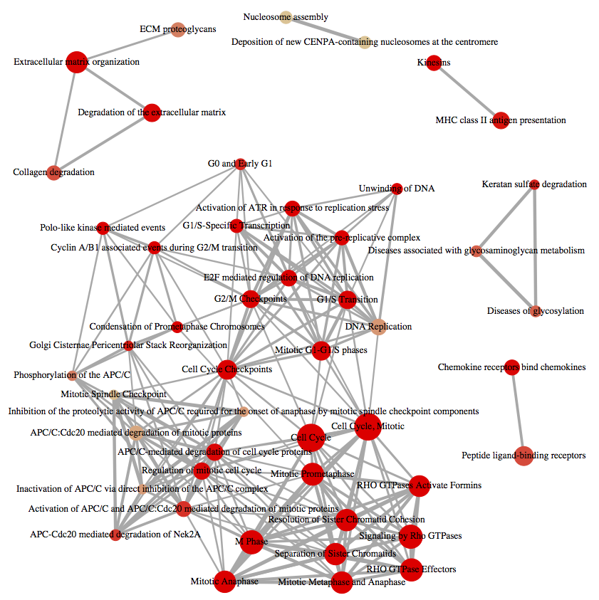
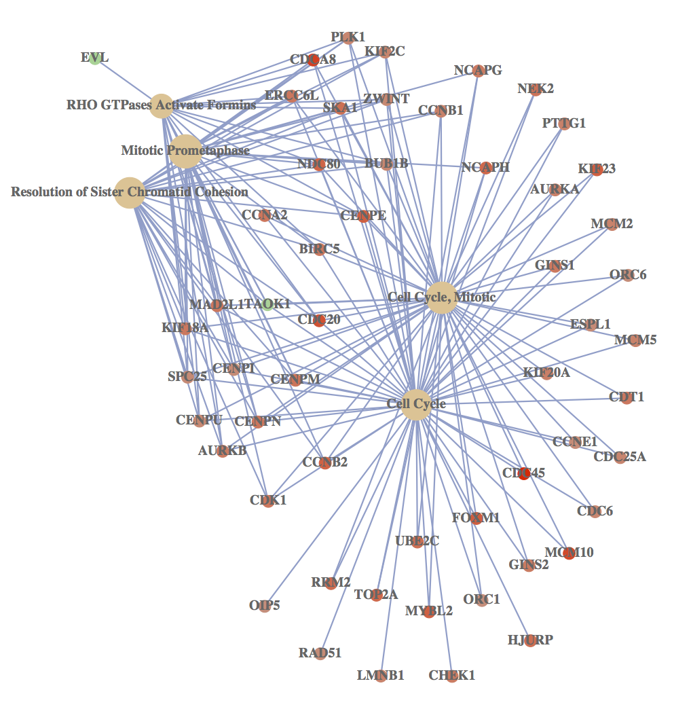
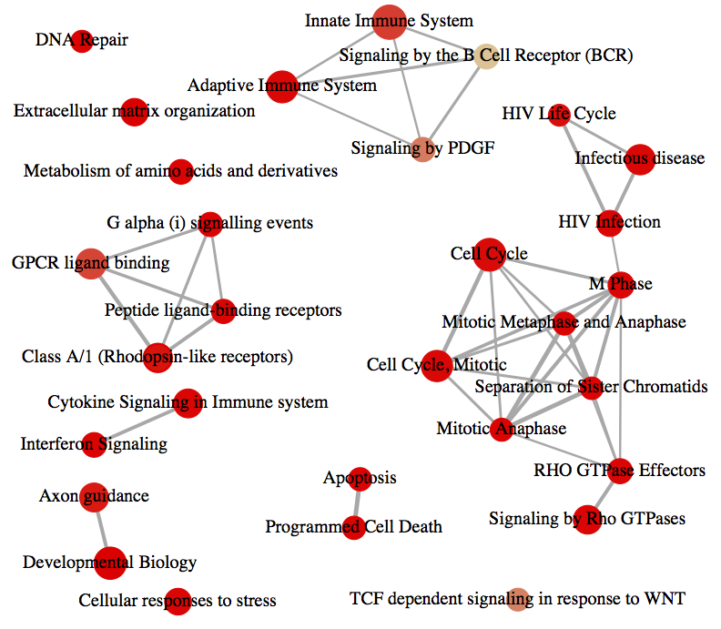
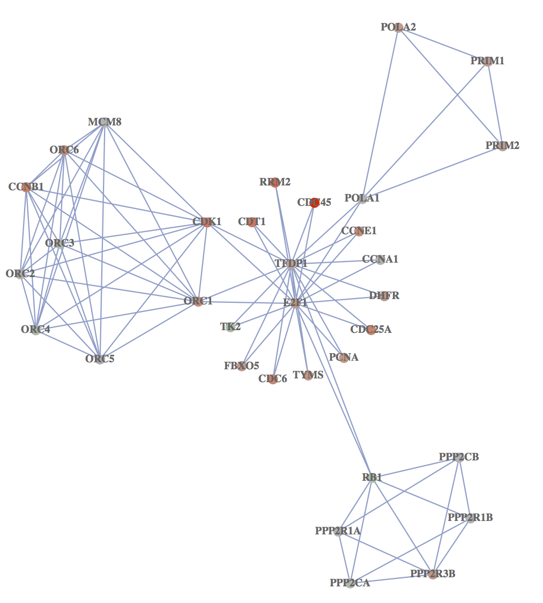

```{r style, echo=FALSE, results="asis", message=FALSE}
BiocStyle::markdown()
knitr::opts_chunk$set(tidy = FALSE,
                      warning = FALSE,
                      message = FALSE)
```

```{r echo=FALSE, results='hide', message=FALSE}
library(org.Hs.eg.db)
library(DOSE)
library(ReactomePA)
```


# Introduction

This package is designed for reactome pathway-based analysis. Reactome
is an open-source, open access, manually curated and peer-reviewed
pathway database.

# Citation

If you use `r Biocpkg("Reactome")`[@yu_reactomepa_2016] in published research, please cite:

__*G Yu*__, QY He^\*^. ReactomePA: an R/Bioconductor package for reactome pathway analysis and visualization. __*Molecular BioSystems*__ 2016, 12(2):477-479. doi:[10.1039/C5MB00663E](http://dx.doi.org/10.1039/C5MB00663E)


# Supported organisms

Currently `r Biocpkg("ReactomePA")` supports several model organisms, including 'celegans', 'fly', 'human', 'mouse', 'rat', 'yeast' and 'zebrafish'. The input gene ID should be Entrez gene ID. We recommend using `clusterProfiler::bitr` to convert biological IDs. For more detail, please refer to [bitr: Biological Id TranslatoR](http://www.bioconductor.org/packages/release/bioc/vignettes/clusterProfiler/inst/doc/clusterProfiler.html#bitr-biological-id-translator).


# Pathway Enrichment Analysis

Enrichment analysis is a widely used approach to identify biological
themes. Here, we implement hypergeometric model to assess whether the
number of selected genes associated with reactome pathway is larger
than expected. The _p_ values were calculated based the hypergeometric model[@boyle2004].


```{r}
library(ReactomePA)
data(geneList)
de <- names(geneList)[abs(geneList) > 1.5]
head(de)
x <- enrichPathway(gene=de,pvalueCutoff=0.05, readable=T)
head(as.data.frame(x))
```

For calculation/parameter details, please refer to the vignette of `r Biocpkg("DOSE")`[@yu_dose_2015]..

## Pathway analysis of NGS data

Pathway analysis using NGS data (eg, RNA-Seq and ChIP-Seq) can be performed by linking coding and non-coding regions to coding genes via `r Biocpkg("ChIPseeker")` package, which can annotates genomic regions to their nearest genes, host genes, and flanking genes respectivly. In addtion, it provides a function, __*seq2gene*__, that simultaneously considering host genes, promoter region and flanking gene from intergenic region that may under control via cis-regulation. This function maps genomic regions to genes in a many-to-many manner and facilitate functional analysis. For more details, please refer to `r Biocpkg("ChIPseeker")`[@yu_chipseeker_2015].


## Visualize enrichment result
We implement barplot, dotplot enrichment map and category-gene-network for visualization. It is very common to visualize the enrichment result in bar or pie chart. We believe the pie chart is misleading and only provide bar chart.
```{r fig.height=4, fig.width=7}
barplot(x, showCategory=8)
```
```{r fig.height=6, fig.width=8}
dotplot(x, showCategory=15)
```

Enrichment map can be viusalized by __*enrichMap*__:
```{r fig.height=16, fig.width=20, eval=FALSE}
enrichMap(x, layout=igraph::layout.kamada.kawai, vertex.label.cex = 1)
```



In order to consider the potentially biological complexities in which a gene may belong to multiple annotation categories, we developed __*cnetplot*__ function to extract the complex association between genes and diseases.
```{r fig.height=12, fig.width=12, eval=FALSE}
cnetplot(x, categorySize="pvalue", foldChange=geneList)
```



## Comparing enriched reactome pathways among gene clusters with clusterProfiler

We have developed an `R` package `r Biocpkg("clusterProfiler")`[@yu_clusterprofiler:_2012] for comparing biological themes among gene clusters. `r Biocpkg("ReactomePA")` works fine with `r Biocpkg("clusterProfiler")` and can compare biological themes at reactome pathway perspective.

```{r fig.height=8, fig.width=13, eval=FALSE}
require(clusterProfiler)
data(gcSample)
res <- compareCluster(gcSample, fun="enrichPathway")
plot(res)
```


# Gene Set Enrichment Analysis

A common approach in analyzing gene expression profiles was identifying differential expressed genes that are deemed interesting. The __*enrichPathway*__ function we demonstrated previously were based on these differential expressed genes. This approach will find genes where the difference is large, but it will not detect a situation where the difference is small, but evidenced in coordinated way in a set of related genes. Gene Set Enrichment Analysis (GSEA)[@subramanian_gene_2005] directly addressed this limitation. All genes can be used in GSEA; GSEA aggregates the per gene statistics across genes within a gene set, therefore making it possible to detect situations where all genes in a predefined set change in a small but coordinated way. For algorithm details, please refer to the vignette of `r Biocpkg("DOSE")`[@yu_dose_2015].

```{r}
y <- gsePathway(geneList, nPerm=1000,
                minGSSize=120, pvalueCutoff=0.2,
                pAdjustMethod="BH", verbose=FALSE)
res <- as.data.frame(y)
head(res)
```

## Visualize GSEA result
```{r fig.height=16, fig.width=16, eval=FALSE}
enrichMap(y)
```




```{r fig.height=7, fig.width=10}
gseaplot(y, geneSetID = "1280215")
```

# Pathway Visualization

In `r Biocpkg("ReactomePA")`, we also implemented __*viewPathway*__ to visualized the pathway.
```{r fig.height=16, fig.width=16, eval=FALSE}
viewPathway("E2F mediated regulation of DNA replication", readable=TRUE, foldChange=geneList)
```




More documents can be found on the project website, <https://guangchuangyu.github.io/ReactomePA>.


# Session Information

Here is the output of `sessionInfo()` on the system on which this document was compiled:

```{r echo=FALSE}
sessionInfo()
```

# References
